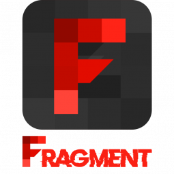

## Introduction
Fragment is a top-tier GTA mod menu with a primary focus on recovery options. However, it also includes a diverse selection of fun and trolling options, making it a great all-around choice.
With its impressive UI, exceptional stability, and one of the most powerful Nuke Crash options on the market, Fragment stands out as a unique and essential menu for anyone looking for something different. Whether you're focused on recovery or just looking to have some fun, Fragment has everything you need to take your GTA modding experience to the next level.

## Setup
1. Go to https://fragmentmenu.com/.
2. Create an account.
3. Check your email (including trash/spam folders) for next steps to activate your Fragment Key.
4. When you have finished the instructions in the email, log in to the website and download the menu from the top right of your screen.
> Before downloading the software, you will need to disable your anti-virus. This is due to the nature of the software and how it interacts with your game. All products sold on RadiantCheats are completely safe and do not contain any form of malicious code.
{.is-warning}
5. Open the loader, log in, and inject.

## Menu Key
- The key to open the menu is <kbd>INSERT</kbd>.