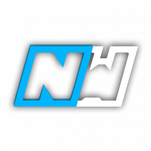

## GTA Introduction
NewWay is the ultimate mod menu for Grand Theft Auto V, developed by a highly experienced team of Brazilian developers with a reputation for excellence. With a focus on simplicity and ease of use, NewWay GTA V is designed to give you the best modding experience possible, without sacrificing safety or functionality.

With all the recovery options you need and none of the complex features you don't, NewWay GTA V is the perfect tool for taking your gameplay to the next level. Whether you're a seasoned modder or just getting started, NewWay makes it easy to become a god of Grand Theft Auto V, with unparalleled control and customization.

So why wait? Experience a new way of being a modder with NewWay GTA V and unlock the full potential of your game. With the most enjoyable and customizable experience possible, there's no limit to what you can achieve in Grand Theft Auto V.

## RDR2 Introduction
Looking for the best mod menu for Red Dead Redemption 2? Look no further than NewWay! With years of experience developing mod menus for various games, the Brazilian-based NewWay team knows how to deliver a modding experience that is both simple and safe.

NewWay RDR2 is designed to provide you with everything you need for an exceptional modding experience. With intuitive and user-friendly features, NewWay RDR2 makes it easy to enjoy all the existing recovery options and the best, safest features without any confusion.

By choosing NewWay RDR2, you can become a true modding god and do whatever you want, whenever you want. So why wait? Join the NewWay community today and experience a whole new way of modding in Red Dead Redemption 2!

## Setup
1. Go to the NewWay website [here](https://newwaymenu.xyz/login), and create a new account using a username, email, password, and the license key you received from us.
2. Log in to your account [here](https://newwaymenu.xyz/login).
3. Head to the `hacks` tab and download the NewWay software.
> Before downloading the software, you will need to disable your anti-virus. This is due to the nature of the software and how it interacts with your game. All products sold on RadiantCheats are completely safe and do not contain any form of malicious code.
{.is-warning}
4. Run the downloaded `.exe` file **as administrator**, and log in using your website credentials.
5. If you're playing Red Dead Redemption 2, launch the game and set the Graphics API to `DX12` and the game to `Windowed Borderless`. If you're playing Grand Theft Auto V, make sure the game is running in `Windowed Borderless` mode and that `Pause Game on Focus Loss` is disabled in the Graphics settings.
6. While on the main menu of the game, open the NewWay software and select `Inject`.

## Key Configuration
- Open/Close: <kbd>F8</kbd> or <kbd>Insert</kbd>
- Select: <kbd>Enter</kbd>
- Back: <kbd>Backspace</kbd>
- Scroll Up: <kbd>Up Arrow</kbd>
- Scroll Down: <kbd>Down Arrow</kbd>
- Increase/Decrease Values: <kbd>Left & Right Arrow</kbd>

## Controller Configuration
- Open/Close: <kbd>← + RB</kbd>
- Select: <kbd>A</kbd>
- Back: <kbd>B</kbd>
- Scroll Up: <kbd>↑</kbd>
- Scroll Down: <kbd>↓</kbd>
- Increase/Decrease Values: <kbd>← and →</kbd>
- Switch Tabs: <kbd>LB and RB</kbd>